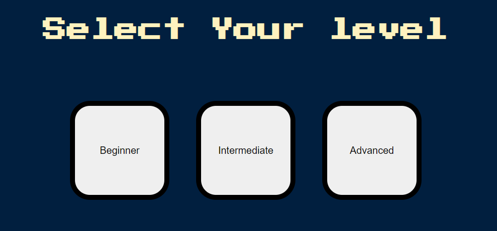

# Simon-Game
 A Memory game called Simon is built using Javascript and it has 3 levels to choose. 


[Live Demo](https://colab.research.google.com/drive/1mujouGGpE88xGXC0pV7ww5U0bV7Abjyg?usp=sharing)

---

### Table of Contents

- [Description](#description)
- [Results](#results)
- [Project Layout](#project-layout)
- [References](#references)
- [Author Info](#author-info)

---

## Description

<br>
The Simon game is the exciting game of lights and sounds in which players must repeat random sequences of lights by pressing the colored pads in the correct order. It's fast-paced play, with lights and sounds that can challenge you. This is automatic game in which the computer shows you a flash on the color.
<br>
<p align="center">
   
  
</p>

### Built With

- Javascript
- HTML
- CSS

### For Execution

Clone the repository into a folder and run the `index.html` to start the game.

<br>

---

## Expert Game Image

  <br/>

<p align="center">
   
  
</p>


#### [Back To The Top](#Simon-Game)

---

## Project Layout

```
Simon-Game
├─ .DS_Store
├─ game.js
├─ Game.PNG
├─ index.html
├─ playGame.html
├─ README.md
├─ select.PNG
└─ styles.css

```

---

## References

- [Simon Game](https://en.wikipedia.org/wiki/Simon_(game))
- [Javascript](https://www.javascript.com/)

---

## Author Info

- LinkedIn - [Srinivas K](https://www.linkedin.com/in/srinivas-konduri/)
- Github - [Srinivas K](https://github.com/srinivaskool)

#### [Back To The Top](#Simon-Game)


